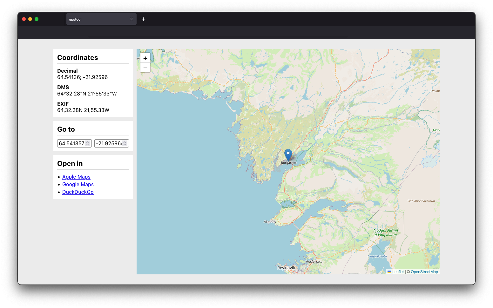

# gpstool

A web-based tool for retrieving and converting GPS coordinates.



## Local development

gpstool is developed using [Vite](https://vitejs.dev/) and [Svelte](https://svelte.dev/).

```bash
npm install
npm run dev
```

## License

Please see the [`LICENSE.md` file](./LICENSE.md) for the license.
